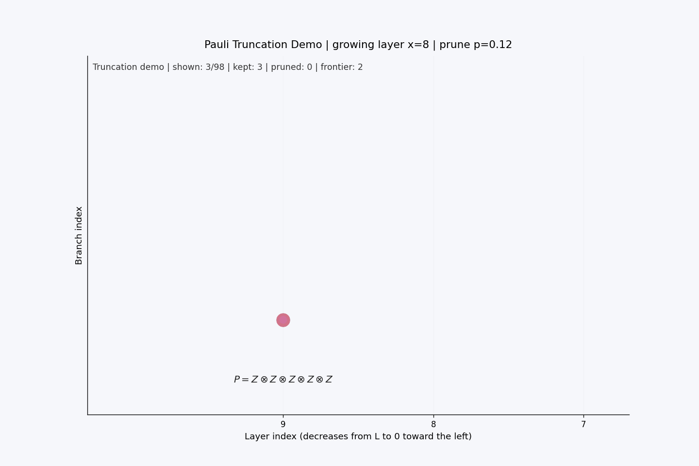
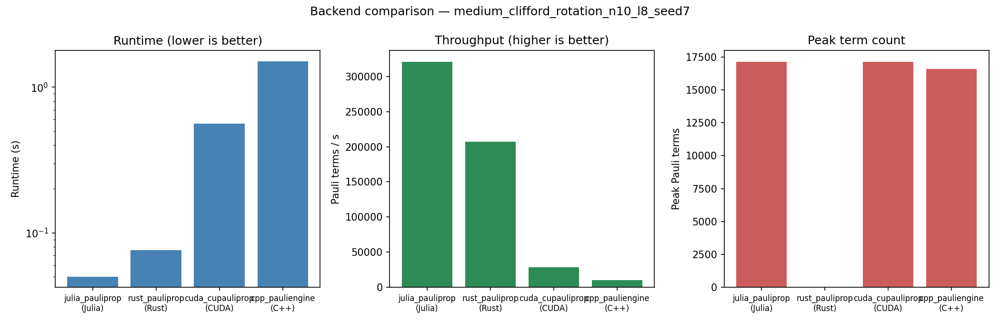
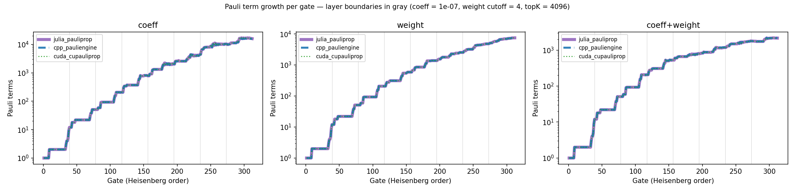
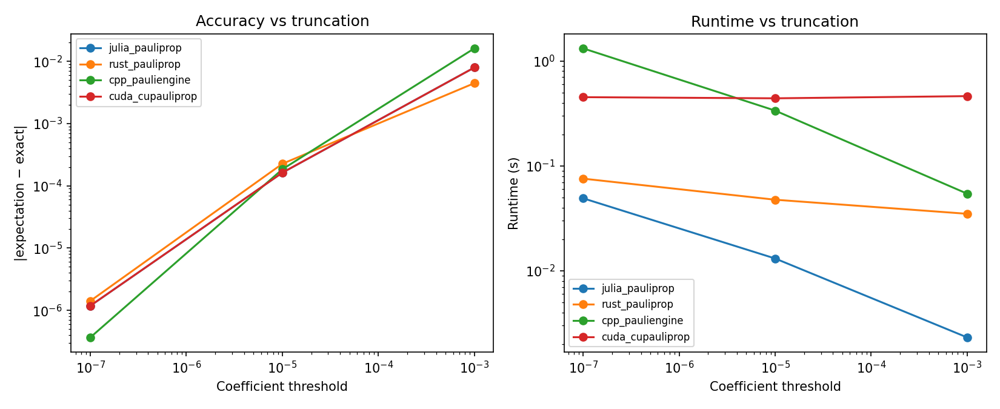
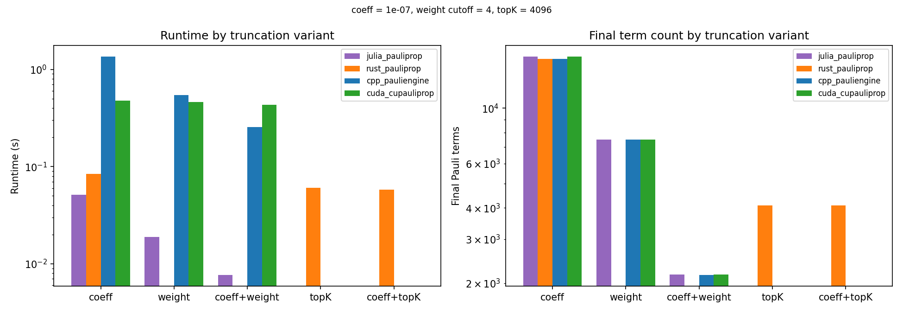

# PPS Backend Benchmark

**Pauli propagation simulation (PPS)** is an emerging classical method for simulating quantum circuits: instead of evolving a state vector, it propagates the *observable* backwards through the circuit in the Heisenberg picture, keeping the operator as a sparse sum of Pauli strings and **truncating** the small or unimportant terms as it grows. With the right truncation it has reproduced 127-qubit quantum-utility-scale experiments on a laptop.

The method is young, and independent implementations have appeared across language ecosystems — each with its own engine design, truncation knobs, and performance profile. **This repository is a cross-language benchmark for them**: the same task specification, the same circuit exchange format, the same result schema, run on Julia, Rust, C++, and CUDA engines and compared head-to-head.

## How Pauli propagation works

A Pauli observable (here `Z⊗Z⊗Z⊗Z⊗Z`) is pushed backwards through the circuit layer by layer. Gates that don't commute with a Pauli string **split** it into two — the operator branches into a growing tree of Pauli terms:


Left unchecked, the term count grows exponentially. **Truncation** is what makes the method practical: branches with small coefficients (or high Pauli weight) are pruned as they appear, keeping the tree sparse at a controlled accuracy cost:



Every engine in this benchmark implements this same propagate-and-truncate loop — what differs is the language, the data structures, and which truncation knobs are available. Regenerate these animations with `python3 scripts/plot.py` and `python3 scripts/truncation_demo.py`.

## Backends

| Backend | Language | Engine | Invocation |
|---|---|---|---|
| `julia_pauliprop` | Julia | [PauliPropagation.jl](https://github.com/MSRudolph/PauliPropagation.jl) | in-process |
| `rust_pauliprop` | Rust | [Qiskit pauli-prop](https://github.com/Qiskit/pauli-prop) | subprocess (embedded CPython) |
| `cpp_pauliengine` | C++ | [PauliEngine](https://github.com/tequilahub/pauliengine) (nanobind) | subprocess (bundled venv) |
| `cuda_cupauliprop` | CUDA | [cuPauliProp](https://docs.nvidia.com/cuda/cuquantum/latest/cupauliprop/overview.html) (cuQuantum) | subprocess (bundled venv) |

### Truncation support matrix

| Truncation | Julia | Rust | C++ | CUDA |
|---|:---:|:---:|:---:|:---:|
| `coefficient_threshold` — drop \|coeff\| < ε | ✓ | ✓ (`atol`) | ✓ | ✓ (`pauli_coeff_cutoff`) |
| `pauli_weight_cutoff` — drop weight > W | ✓ | — | ✓ | ✓ |
| `max_terms` — keep largest K terms | — | ✓ | — | — |
| `lowesa_surrogate` — Fourier `max_freq` + `max_weight` | ✓ | — | — | — |
| Combinations of the above | ✓ | ✓ | ✓ | ✓ |

Every result records the truncation actually applied as a structured `truncation_applied` object — no downstream guessing.

## Quick start

```bash
# Julia orchestration layer + Julia backend (no build needed)
make instantiate
make test          # full integration suite
make smoke         # 4-qubit single run, JSON result on stdout

# Optional backends
make build-rust  && make smoke-rust    # needs cargo
make build-cpp   && make smoke-cpp     # C++ pauliengine optional; falls back to Python
make build-cuda  && make smoke-cuda    # needs an NVIDIA GPU + cuquantum

# Cross-backend comparison on the 10-qubit medium task
make benchmark-medium
```

`benchmark-medium` runs every locally available backend on `configs/bench_medium.toml` and writes `results/comparison_medium.{md,png}`:



## Benchmark dimensions

### Cross-engine agreement



*Per-gate Pauli term growth on the 10-qubit task. The Julia, C++, and CUDA engines produce identical term counts after every gate — the curves overlap exactly — which doubles as a cross-engine correctness check.*

### Accuracy / speed vs truncation threshold

```bash
python3 scripts/sweep_truncation.py
```



### Truncation types and combinations per backend

```bash
python3 scripts/compare_truncation_types.py
```



### 127-qubit LOWESA reproduction

The `lowesa_tfi_127_L5_*.toml` configs reproduce the 158-angle magnetization sweep of Rudolph et al. 2023 (Fig. 2a) on the IBM Eagle topology, validated against the IBM utility-paper exact curve (RMSE ≈ 4e-3). See [docs/lowesa_tfi_127_benchmark.md](docs/lowesa_tfi_127_benchmark.md).

```bash
make benchmark-lowesa-127        # Julia surrogate sweep
make benchmark-lowesa-127-all    # all backends (GPU/HPC recommended)
```

## Result schema

Every backend emits one JSON object per run:

```jsonc
{
  "backend": "julia_pauliprop",
  "task_id": "medium_clifford_rotation_n10_l8_seed7",
  "success": true,
  "runtime_sec": 0.052,
  "memory_bytes": 2048000,
  "final_terms": 16083,
  "peak_terms": 17146,                  // max term count during propagation
  "throughput_terms_per_sec": 3.1e5,
  "expectation": 0.1184,
  "reference": 0.1184,                  // exact (untruncated) value when tractable
  "absolute_error": 1.2e-6,
  "metadata": {
    "truncation_applied": { "method": "threshold", "coefficient_threshold": 1e-7, /* ... */ },
    "terms_history": [1, 2, 2, ...],    // per-gate term counts (single runs)
    "memory_measure": "process_peak_rss",
    "thread_limits": { "OMP_NUM_THREADS": "1", /* ... */ }
  }
}
```

All benchmarks are pinned to a **single core** (thread-pool environment variables are forced to 1 and recorded) so cross-language runtimes are comparable.

## Repository layout

```
configs/      benchmark specifications (TOML)
src/          Julia orchestration layer + backend wrappers
benchmarks/   executable entry points (run_backend.jl, run_sweep.jl)
wrappers/     Rust / C++ / CUDA / Python runner implementations
scripts/      comparison, validation, and demo-animation tooling (Python)
docs/         per-backend notes, exchange-format spec, figures
results/      generated outputs (not tracked)
```

Per-backend documentation: [Rust](docs/rust_pauliprop_backend.md) · [C++](docs/cpp_pauliengine_backend.md) · [CUDA](docs/cuda_cupauliprop_backend.md) · [circuit exchange format](docs/circuit_exchange_schema.md)

## Reproducibility

- Deterministic seeds in every config; parameter rules documented in result metadata.
- Engine versions, thread limits, and memory measurement method recorded per run.
- `memory_bytes` semantics differ by backend (Julia: allocation bytes; others: peak RSS) and are labeled via `metadata.memory_measure` — compare within a backend, not across.
